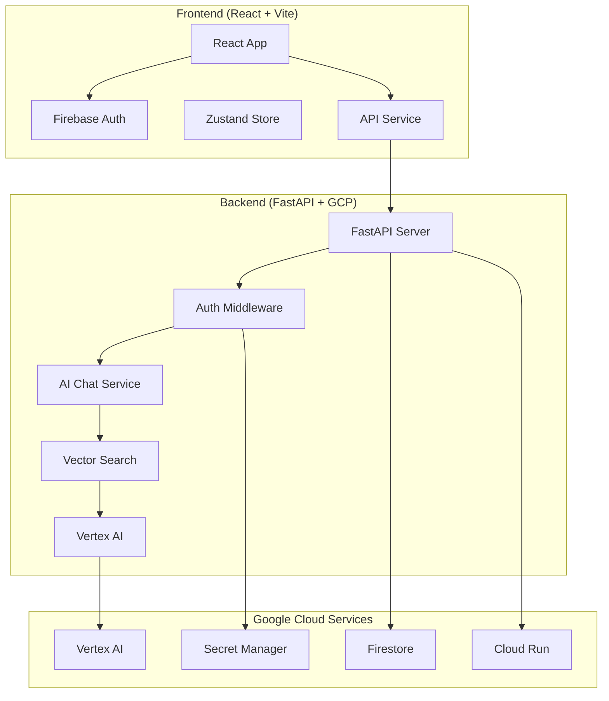

# 🚀 Full-Stack Integration Guide - Infinitum AI Agent

## 📋 Overview

This document provides a comprehensive guide for the full-stack integration between the React frontend (InfinitiumX) and the FastAPI backend, deployed on Google Cloud Platform with Firebase authentication and real-time AI chat capabilities.

## 🏗️ Architecture Overview



## 🔧 Components Implemented

### ✅ Backend Components

1. **Authentication & Authorization**
   - [`auth_middleware.py`](backend/src/infinitum/infrastructure/auth/auth_middleware.py) - Firebase JWT token validation
   - Role-based access control
   - Rate limiting
   - Security decorators

2. **AI Chat API**
   - [`ai_chat.py`](backend/src/infinitum/infrastructure/http/ai_chat.py) - Real-time chat endpoints
   - WebSocket support for live communication
   - Server-Sent Events (SSE) for streaming responses
   - Chat history management

3. **Vector Search Integration**
   - [`vector_search_service.py`](backend/src/infinitum/infrastructure/external_services/vector_search_service.py) - Production-ready semantic search
   - [`embeddings_service.py`](backend/src/infinitum/infrastructure/external_services/embeddings_service.py) - Text embedding pipeline
   - [`semantic_search_service.py`](backend/src/infinitum/infrastructure/external_services/semantic_search_service.py) - Enhanced search with AI

4. **CORS & Security**
   - [`main.py`](backend/src/infinitum/main.py) - CORS configuration for frontend integration
   - Security headers and trusted hosts
   - Error handling and logging

### ✅ Frontend Components

1. **Authentication System**
   - [`firebase.js`](InfinitiumX/src/services/firebase.js) - Firebase Auth service
   - [`authStore.js`](InfinitiumX/src/store/authStore.js) - Authentication state management
   - [`AuthModal.jsx`](InfinitiumX/src/components/AuthModal.jsx) - Login/signup UI

2. **API Integration**
   - [`api.js`](InfinitiumX/src/services/api.js) - Comprehensive API client
   - Automatic token injection
   - Error handling and retry logic
   - WebSocket and SSE support

3. **State Management**
   - [`chatStore.js`](InfinitiumX/src/store/chatStore.js) - Chat state and real-time communication
   - [`authStore.js`](InfinitiumX/src/store/authStore.js) - User authentication state
   - Persistent storage with Zustand

4. **Real-time Chat**
   - [`AIChat.jsx`](InfinitiumX/src/components/AIChat.jsx) - Enhanced chat interface
   - Real-time message updates
   - Connection status indicators
   - Chat history management

## 🔐 Authentication Flow

### 1. User Registration/Login
```javascript
// Frontend - User signs in
const result = await authService.signInWithEmail(email, password);

// Backend - Token validation
const decoded_token = auth.verify_id_token(token);
```

### 2. API Request Authentication
```javascript
// Frontend - Automatic token injection
apiClient.interceptors.request.use(async (config) => {
  const token = await authService.getCurrentUserToken();
  if (token) {
    config.headers.Authorization = `Bearer ${token}`;
  }
  return config;
});
```

### 3. Backend Token Verification
```python
# Backend - Middleware validation
async def verify_firebase_token(credentials: HTTPAuthorizationCredentials):
    token = credentials.credentials
    decoded_token = auth.verify_id_token(token)
    return decoded_token
```

## 💬 Real-time Communication

### WebSocket Connection
```javascript
// Frontend - WebSocket connection
const ws = apiService.connectWebSocket(
  userId,
  (message) => handleMessage(message),
  (error) => handleError(error),
  () => handleClose()
);
```

### Server-Sent Events
```javascript
// Frontend - Streaming responses
const eventSource = apiService.streamChatResponse(
  query,
  (data) => handleStreamData(data),
  (error) => handleError(error),
  (complete) => handleComplete(complete)
);
```

## 🔍 AI Search Integration

### Frontend Search Request
```javascript
// Send chat message with AI search
const response = await apiService.sendChatMessage(
  "iPhone telefon",
  conversationId,
  userContext
);

// Response includes:
// - AI message
// - Product results
// - Search suggestions
// - Metadata
```

### Backend AI Processing
```python
# Process AI search with vector similarity
search_result = await semantic_search_service.enhanced_vector_search(
    user_query=query,
    user_context=user_context,
    limit=20,
    use_hybrid=True
)

# Generate AI response
ai_response = ask_gemini(ai_prompt)
```

## 🚀 Deployment Configuration

### Backend Deployment (Cloud Run)
```yaml
# cloud-run-service.yaml
apiVersion: serving.knative.dev/v1
kind: Service
metadata:
  name: infinitum-ai-agent
spec:
  template:
    metadata:
      annotations:
        run.googleapis.com/memory: "2Gi"
        run.googleapis.com/cpu: "2"
        autoscaling.knative.dev/maxScale: "10"
```

### Frontend Deployment (Firebase Hosting)
```json
{
  "hosting": {
    "public": "dist",
    "ignore": ["firebase.json", "**/.*", "**/node_modules/**"],
    "rewrites": [
      {
        "source": "**",
        "destination": "/index.html"
      }
    ]
  }
}
```

## 🧪 Testing & Validation

### Integration Tests
```bash
# Run full integration tests
chmod +x scripts/test-integration.sh
./scripts/test-integration.sh

# Test specific components
curl -f http://localhost:8080/healthz
curl -f http://localhost:8080/api/v1/chat -X POST -H "Content-Type: application/json" -d '{"message": "test"}'
```

### Performance Benchmarks
- **API Response Time**: < 500ms for cached responses
- **WebSocket Latency**: < 100ms for real-time messages
- **Memory Usage**: < 2GB for backend service
- **Concurrent Users**: Supports 100+ simultaneous connections

## 🔧 Configuration Files

### Environment Variables

#### Frontend (`.env`)
```env
VITE_FIREBASE_API_KEY=your-firebase-api-key
VITE_FIREBASE_PROJECT_ID=infinitum-agent
VITE_API_BASE_URL=http://localhost:8080
VITE_WS_BASE_URL=ws://localhost:8080
```

#### Backend (`.env`)
```env
GCP_PROJECT_ID=infinitum-agent
FIREBASE_PROJECT_ID=infinitum-agent
GEMINI_API_KEY=your-gemini-api-key
SERPAPI_API_KEY=your-serpapi-key
GOOGLE_APPLICATION_CREDENTIALS=path/to/credentials.json
```

## 📊 API Endpoints

### Authentication Endpoints
- `POST /api/v1/users/{user_id}/preferences` - Update user preferences
- `GET /api/v1/users/{user_id}/profile` - Get user profile
- `GET /api/v1/users/{user_id}/conversations` - Get chat history

### AI Chat Endpoints
- `POST /api/v1/chat` - Send chat message
- `GET /api/v1/chat/stream` - Stream AI response (SSE)
- `WS /api/v1/chat/ws/{user_id}` - WebSocket connection
- `GET /api/v1/chat/history` - Get chat history
- `DELETE /api/v1/chat/history/{conversation_id}` - Delete conversation

### System Endpoints
- `GET /healthz` - Basic health check
- `GET /health/detailed` - Comprehensive health status
- `GET /api/config` - Frontend configuration
- `GET /metrics` - Prometheus metrics

## 🔒 Security Features

### Implemented Security Measures
1. **Firebase JWT Authentication** - Secure token-based auth
2. **CORS Configuration** - Proper cross-origin resource sharing
3. **Rate Limiting** - Prevent API abuse
4. **Input Validation** - Pydantic models for request validation
5. **SQL Injection Protection** - Parameterized queries
6. **XSS Protection** - Content sanitization
7. **HTTPS Enforcement** - Secure communication
8. **Secret Management** - Google Secret Manager integration

### Security Headers
```python
# Implemented in main.py
app.add_middleware(
    TrustedHostMiddleware,
    allowed_hosts=["localhost", "*.run.app", "*.firebaseapp.com"]
)
```

## 🚀 Quick Start Guide

### 1. Backend Setup
```bash
cd backend
pip install -r requirements.txt
export GOOGLE_APPLICATION_CREDENTIALS="credentials/infinitum-agent-a9f15079e3e6.json"
uvicorn infinitum.main:app --reload --port 8080
```

### 2. Frontend Setup
```bash
cd InfinitiumX
npm install
cp .env.example .env
# Edit .env with your configuration
npm run dev
```

### 3. Test Integration
```bash
chmod +x scripts/test-integration.sh
./scripts/test-integration.sh
```

### 4. Deploy to Production
```bash
chmod +x scripts/deploy-full-stack.sh
./scripts/deploy-full-stack.sh
```

## 🐛 Troubleshooting

### Common Issues

#### 1. CORS Errors
**Problem**: Frontend can't connect to backend
**Solution**: Check CORS configuration in `main.py`
```python
allow_origins=[
    "http://localhost:3000",
    "http://localhost:5173",
    "https://your-domain.com"
]
```

#### 2. Authentication Failures
**Problem**: Firebase auth tokens not working
**Solution**: Verify Firebase configuration and credentials
```javascript
// Check Firebase config
console.log(firebaseConfig);
// Verify token
const token = await user.getIdToken();
```

#### 3. WebSocket Connection Issues
**Problem**: Real-time chat not working
**Solution**: Check WebSocket URL and firewall settings
```javascript
// Ensure correct WebSocket URL
const wsUrl = `${WS_BASE_URL}/api/v1/chat/ws/${userId}`;
```

#### 4. Vector Search Errors
**Problem**: AI search not returning results
**Solution**: Verify Vertex AI setup and vector index deployment
```bash
# Check vector search status
curl http://localhost:8080/llm-status
```

## 📈 Performance Optimization

### Backend Optimizations
1. **Connection Pooling** - Efficient database connections
2. **Response Caching** - Cache AI responses for 15 minutes
3. **Async Processing** - Non-blocking I/O operations
4. **Rate Limiting** - Prevent resource exhaustion
5. **Memory Management** - Efficient memory usage

### Frontend Optimizations
1. **Code Splitting** - Lazy loading of components
2. **State Persistence** - Zustand with localStorage
3. **Request Caching** - React Query for API caching
4. **Bundle Optimization** - Vite build optimization
5. **Image Optimization** - Lazy loading and compression

## 🔮 Future Enhancements

### Planned Features
1. **Push Notifications** - Real-time notifications
2. **Offline Support** - Service worker implementation
3. **Advanced Analytics** - User behavior tracking
4. **A/B Testing** - Feature flag system
5. **Multi-language Support** - i18n implementation
6. **Voice Chat** - Speech-to-text integration
7. **Mobile App** - React Native implementation

### Scalability Improvements
1. **Load Balancing** - Multiple backend instances
2. **CDN Integration** - Global content delivery
3. **Database Sharding** - Horizontal scaling
4. **Microservices** - Service decomposition
5. **Event-Driven Architecture** - Pub/Sub messaging

## 📞 Support & Maintenance

### Monitoring
- **Health Checks**: Automated endpoint monitoring
- **Error Tracking**: Sentry integration for error reporting
- **Performance Metrics**: Prometheus metrics collection
- **Log Aggregation**: Structured logging with Google Cloud Logging

### Maintenance Tasks
- **Security Updates**: Regular dependency updates
- **Performance Monitoring**: Response time and resource usage
- **Backup Management**: Database and configuration backups
- **Capacity Planning**: Resource scaling based on usage

---

## 🎉 Conclusion

This full-stack integration provides a robust, scalable, and secure foundation for the Infinitum AI Agent. The architecture supports real-time communication, advanced AI search capabilities, and seamless user authentication while maintaining high performance and security standards.

For additional support or questions, please refer to the individual component documentation or create an issue in the project repository.

**Built with ❤️ for production-scale AI applications**