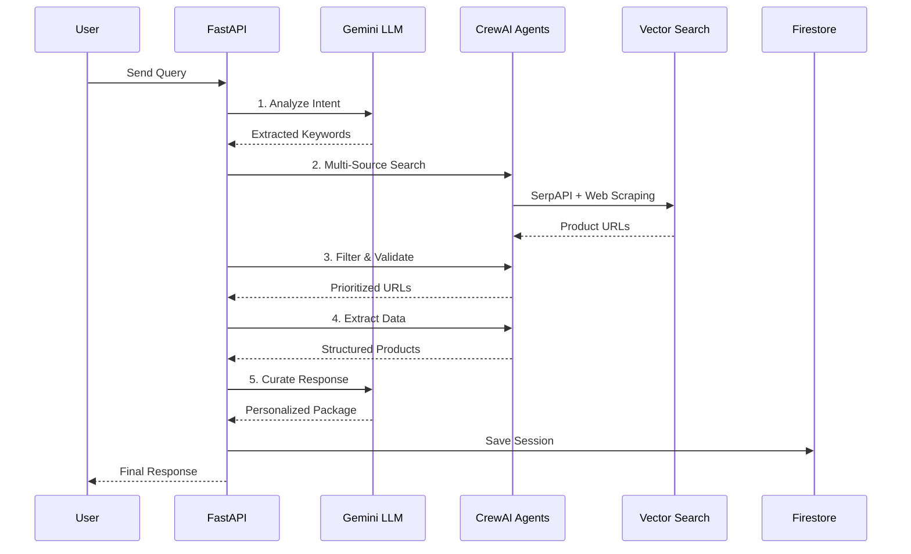

<div align="center" style="display: flex; align-items: center; justify-content: center; gap: 15px;">


# Infinitum AI Agent


**Yapay Zeka Destekli Akıllı Ürün Arama ve Öneri Platformu**

[](https://python.org)
[](https://fastapi.tiangolo.com)
[](https://cloud.google.com/vertex-ai)
[](https://crewai.com)
[](https://ai.google.dev/gemini-api)

*Gemini LLM, Vector Search ve Multi-Agent AI Sistemleri ile güçlendirilmiş akıllı ürün arama*

</div>

---

## 📖 Proje Hakkında

Infinitum AI Agent, kullanıcıların doğal dilde yaptıkları istekleri anlayarak, internetten en uygun ürünleri bulan ve kişiselleştirilmiş öneriler sunan gelişmiş bir yapay zeka platformudur.

### Örnek Kullanım Senaryosu

**Kullanıcı:** Uygulamada arama kısmına *"Kız kardeşimin düğünü var ve kıyafet bulmam gerekiyor bana elbiseler ve kombinler bul."* şeklinde bir prompt girer.

**AI Agent Süreci:**
1.  **İstek Analizi** - Gemini LLM isteği analiz eder (düğün, kadın kıyafeti, kombinler, düğünde giyilebilecek ürünler)
2.  **Akıllı Arama** - Multi-agent sistem farklı e-ticaret sitelerinde veya kendi Vertex veritabanında arama yapar 
3.  **Ürün Filtreleme** - Bulunan ürünler kalite, fiyat ve uygunluk açısından değerlendirilir
4.  **Kişiselleştirme** - Kullanıcı tercihlerine göre en uygun seçenekler belirlenir
5.  **Paket Önerisi** - Komple kombinler ve alternatifler sunulur

**Sonuç:** Kullanıcı, düğün için uygun elbiseler, ayakkabılar, aksesuarlar ve komple kombinleri içeren kişiselleştirilmiş bir paket önerisi alır. Ek olarak paketler, ürünler için yorumlardan ve açıklamalardan analiz ederek "Neden bu ürün/paket?" gibi açıklamalar ekleyerek kullanıcaya gösterir.

---

## Projeden Ekran Görüntüleri

<!-- Buraya ekran görüntüleri eklenecek -->

###  Arama Arayüzü


###  AI Arama Süreci ve Ek Prompt girilmesi


###  Arama Sonuçları


---

##  Temel Özellikler

###  **Gelişmiş AI Yetenekleri**
- **Gemini 2.5 Pro/Flash Entegrasyonu** - Akıllı sorgu işleme ve keyword extraction için LLM
- **Multi-Agent Mimarisi** - CrewAI destekli agentlar ile araştırma ve analiz
- **Semantik Vector Arama** - Vertex AI embeddings ile benzerlik eşleştirmesi
- **Akıllı Sorgu Geliştirme** - Bağlam farkında arama optimizasyonu

###  **Akıllı Ürün Keşfi**
- **Hibrit Arama Motoru** - Semantik arama ile geleneksel anahtar kelime eşleştirmesini birleştirir
- **Akıllı Paket Oluşturma** - Kullanıcı niyetine göre AI tarafından düzenlenmiş ürün paketleri
- **Kişiselleştirilmiş Öneriler** - Kullanıcı bağlamı ve tercih öğrenimi
- **Çoklu Kaynak Veri Toplama** - SerpAPI, web scraping ve ürün veritabanları
- **Fiyat Karşılaştırması ve Analizi** - Birden fazla satıcıdan gerçek zamanlı fiyat verileri

### 🏗 **Üretime Hazır Altyapı**
- **Ölçeklenebilir Bulut Mimarisi** - Otomatik ölçeklendirme ile Google Cloud Run
- **Kapsamlı İzleme** - Yapılandırılmış loglama, metrikler ve izleme
- **Güvenlik Öncelikli** - JWT kimlik doğrulama, girdi doğrulama ve güvenli kimlik bilgisi yönetimi
- **Yüksek Performans** - Asenkron işlemler, caching ve bağlantı havuzu mekanizmaları kullanıldı

##  API Örnekleri

###  **Temel Sohbet İsteği**
```bash
curl -X POST "http://localhost:8080/api/v1/chat" \
  -H "Content-Type: application/json" \
  -d '{
    "message": "200 TL altında kablosuz kulaklık bul",
    "conversation_id": "conv-123"
  }'
```


###  **Paket Oluşturma**
```bash
curl -X POST "http://localhost:8080/api/v1/packages" \
  -H "Content-Type: application/json" \
  -d '{
    "query": "I want to buy home accessories",
    "metadata": {
      "source": "postman-test",
      "category": "home-decor"
    },
    "user_id": "{{user_id}}",
    "preferences": {
      "budget_range": "mid-range",
      "style": "modern"
    }
  }'
```


---

# Mimari Genel Bakış

## **5 Workflow**


##  **Google Cloud Platform Altyapısı**


### **Kullanılan GCP Servisleri**
- **[Vertex AI](https://cloud.google.com/vertex-ai)** - Gemini LLM hosting ve vector search
- 
- **[Cloud Run](https://cloud.google.com/run)** - Serverless container deployment
- **[Firestore](https://cloud.google.com/firestore)** - NoSQL document database
- 
- **[Secret Manager](https://cloud.google.com/secret-manager)** - API key management
- **[Cloud Storage](https://cloud.google.com/storage)** - Vector embeddings storage
- 
- **[Container Registry](https://cloud.google.com/container-registry)** - Docker image 

---
##  **RAG (Retrieval-Augmented Generation) Sistemi**

Infinitum AI Agent, gelişmiş bir RAG mimarisi kullanarak kullanıcı sorgularını işler ve kişiselleştirilmiş ürün önerileri sunmayı amaçlamaktadır:

### **RAG İş Akışı:**

1. ** Query Processing (Sorgu İşleme)**
   - Kullanıcının doğal dil sorgusunu Gemini LLM ile analiz eder
   - Anahtar kelimeleri, kategorileri ve kullanıcı niyetini çıkarır
   - Sorguyu yapılandırılmış arama parametrelerine dönüştürür

2. ** Retrieval (Bilgi Getirme)**
   - **Vector Search**: Vertex AI ile 768 boyutlu embeddings kullanarak semantik arama
   - **External APIs**: SerpAPI ile gerçek zamanlı ürün verisi çekme
   - **Web Scraping**: Crawl4AI ile e-ticaret sitelerinden ürün detayları
   - **Database Query**: Firestore'dan geçmiş arama sonuçları ve kullanıcı tercihleri

3. ** Augmentation (Veri Zenginleştirme)**
   - Çekilen ürün verilerini kalite, fiyat ve uygunluk açısından filtreler
   - Kullanıcı profiline göre relevans skorları hesaplar
   - Benzer ürünleri gruplar ve paket önerileri oluşturur
   - Ürün yorumları ve açıklamalarını analiz eder

4. ** Generation (Yanıt Üretme)**
   - Zenginleştirilmiş veriyi Gemini LLM'e context olarak verir
   - Kişiselleştirilmiş ürün paketleri ve açıklamalar üretir
   - "Neden bu ürün?" mantığını açıklayan detaylar ekler
   - Kullanıcı dostu format ve sunum oluşturur

### **RAG'in Avantajları:**
- **Doğruluk**: Gerçek zamanlı veri ile güncel bilgi
- **Dinamiklik**: Sürekli güncellenen ürün katalogu
- **Akıllılık**: LLM'in anlama yetisi + güncel veri
- **Hız**: Vector search ile milisaniye cevap süresi
- **Kişiselleştirme**: Kullanıcı geçmişi ile özelleştirilmiş öneriler

---

###  **Yapılandırılmış Loglama**
```bash
# Sağlık kontrolü
curl http://localhost:8080/healthz

# Detaylı sistem durumu
curl http://localhost:8080/health/detailed

# Prometheus metrikleri
curl http://localhost:8080/metrics
```
# Admin Log Dashboard
Geliştirme sürecinde katmanları ve logları daha iyi analiz edebilmek için geliştirilmiştir.
http://localhost:8080/admin/logs/dashboard


---


##  Hedeflenen Kullanıcı Profilleri

###  **E-Ticaret Entegrasyonu**
Infinitum AI Agent, büyük e-ticaret platformlarının arama deneyimini devrim niteliğinde geliştirmeyi hedeflemektedir:

- **[Trendyol](https://www.trendyol.com) ve [Hepsiburada](https://www.hepsiburada.com)** - Türkiye'nin önde gelen e-ticaret platformuna AI destekli API tabanlı entegrasyon
- **Diğer E-Ticaret Platformları** - GittiGidiyor, N11, Amazon Türkiye gibi platformlara uyarlanabilir çözümler

###  **Fiyat Karşılaştırma Platformu**
Mevcut fiyat karşılaştırma sitelerine alternatif olarak yeni nesil bir platform geliştirme hedefi:

- **[Akakçe](https://www.akakce.com) ve [Cimri](https://www.cimri.com)   Benzeri Platform** - AI destekli akıllı fiyat karşılaştırması ve Gelişmiş ürün analizi ve öneri sistemi
- **Yenilikçi Özellikler** - Doğal dil işleme ile akıllı arama, otomatik paket önerileri, kişiselleştirilmiş alışveriş deneyimi

###  **Ticari Hedefler**
- **B2B Entegrasyon** - Mevcut e-ticaret platformlarına API tabanlı entegrasyon
- **B2C Platform** - Bağımsız akıllı alışveriş asistanı platformu
- **SaaS Çözümü** - E-ticaret şirketleri için hazır AI arama çözümü
- **White-Label Ürün** - Markalı çözümler için özelleştirilebilir platform

---

## Dökümantasyonlar

**[📖 Dokümantasyonu Okuyun](backend/docs/README.md)** • **[🔧 Hızlı Kurulum](#-hızlı-başlangıç)** • **[💬 Topluluğa Katılın](https://github.com/your-org/infinitum-ai-agent/discussions)**

---

** BTK Hackathon'25 için Infinitum AI Ekibi tarafından geliştirilmiştir**

*Gelişmiş AI ve makine öğrenmesi ile akıllı ürün keşfini güçlendiriyoruz*

</div>
