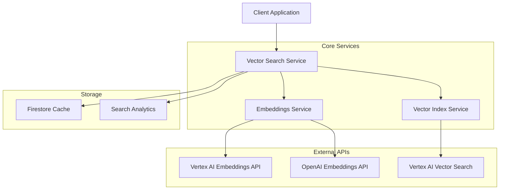

# Vector Search System Documentation

## Overview

This comprehensive vector search implementation provides production-ready semantic search capabilities for Google Cloud Vertex AI. The system includes vector index management, embeddings generation, and advanced search functionality with filtering, pagination, and performance optimization.

## Architecture



## Components

### 1. Vector Index Service (`vector_index_service.py`)

Manages Vertex AI Vector Search indexes and endpoints.

**Key Features:**
- Index creation and deployment
- Endpoint management
- Index updates and maintenance
- Status monitoring
- Resource cleanup

### 2. Embeddings Service (`embeddings_service.py`)

Handles text-to-vector conversion with multiple provider support.

**Key Features:**
- Batch processing with rate limiting
- Multiple embedding models (Vertex AI, OpenAI)
- Intelligent caching
- Error handling and retries
- Performance monitoring

### 3. Vector Search Service (`vector_search_service.py`)

Provides production-ready semantic search functionality.

**Key Features:**
- Semantic similarity search
- Hybrid search (semantic + keyword)
- Filtering and pagination
- Personalized recommendations
- Search analytics
- Result caching

## Quick Start

### 1. Installation

```bash
# Install required dependencies
pip install -r requirements.txt

# Set up Google Cloud credentials
export GOOGLE_APPLICATION_CREDENTIALS="path/to/your/credentials.json"
export GCP_PROJECT_ID="your-project-id"
```

### 2. Deploy Infrastructure

```bash
# Make deployment script executable
chmod +x backend/infra/deploy-vector-search.sh

# Deploy vector search infrastructure
./backend/infra/deploy-vector-search.sh

# For development with sample data
./backend/infra/deploy-vector-search.sh --with-sample-data
```

### 3. Basic Usage

```python
from infinitum.infrastructure.external_services.vector_search_service import vector_search_service

# Perform semantic search
result = await vector_search_service.semantic_search(
    query="wireless bluetooth headphones",
    limit=10,
    similarity_threshold=0.7
)

print(f"Found {len(result.results)} results")
for item in result.results:
    print(f"- {item.id}: {item.score:.3f}")
```

## Detailed Usage Examples

### Embeddings Generation

#### Single Embedding

```python
from infinitum.infrastructure.external_services.embeddings_service import embeddings_service

# Generate single embedding
result = await embeddings_service.generate_embedding(
    text="High-quality wireless headphones with noise cancellation",
    model="vertex-text-embedding-004",
    task_type="SEMANTIC_SIMILARITY"
)

if result.error is None:
    print(f"Generated {len(result.embedding)}-dimensional embedding")
    print(f"Model used: {result.model_used}")
    print(f"Processing time: {result.processing_time:.3f}s")
```

#### Batch Embeddings

```python
from infinitum.infrastructure.external_services.embeddings_service import EmbeddingRequest

# Prepare batch requests
requests = [
    EmbeddingRequest(id="product_1", text="Sony WH-1000XM4 headphones"),
    EmbeddingRequest(id="product_2", text="Apple AirPods Pro"),
    EmbeddingRequest(id="product_3", text="Bose QuietComfort 35 II")
]

# Generate batch embeddings
batch_result = await embeddings_service.generate_batch_embeddings(
    requests=requests,
    model="vertex-text-embedding-004",
    batch_size=10,
    max_concurrent=3
)

print(f"Batch completed: {batch_result.success_count} success, {batch_result.error_count} errors")
print(f"Total processing time: {batch_result.total_processing_time:.2f}s")
```

#### Prepare Data for Vector Index

```python
# Prepare embeddings for vector index upload
preparation_result = await embeddings_service.prepare_vector_index_data(
    embeddings_results=batch_result.results,
    output_gcs_path="gs://your-bucket/embeddings/products.jsonl.gz",
    metadata_fields=["category", "brand", "price_range"]
)

if preparation_result["success"]:
    print(f"Prepared {preparation_result['total_vectors']} vectors")
    print(f"Uploaded to: {preparation_result['gcs_uri']}")
```

### Vector Index Management

#### Create Vector Index

```python
from infinitum.infrastructure.external_services.vector_index_service import vector_index_service

# Create a new vector index
index_result = await vector_index_service.create_vector_index(
    index_name="product-search-index",
    dimensions=768,
    distance_measure="COSINE_DISTANCE",
    algorithm_config={
        "treeAhConfig": {
            "leafNodeEmbeddingCount": 500,
            "leafNodesToSearchPercent": 7
        }
    },
    metadata={"environment": "production", "use_case": "product_search"}
)

if index_result["success"]:
    print(f"Index created: {index_result['index_id']}")
```

#### Create Index Endpoint

```python
# Create endpoint for serving searches
endpoint_result = await vector_index_service.create_index_endpoint(
    endpoint_name="product-search-endpoint",
    description="Production endpoint for product search",
    enable_private_service_connect=False
)

if endpoint_result["success"]:
    print(f"Endpoint created: {endpoint_result['endpoint_id']}")
```

#### Deploy Index to Endpoint

```python
# Deploy index to endpoint
deployment_result = await vector_index_service.deploy_index_to_endpoint(
    index_name="product-search-index",
    endpoint_name="product-search-endpoint",
    deployed_index_id="product_search_v1",
    machine_type="n1-standard-2",
    min_replica_count=1,
    max_replica_count=3
)

if deployment_result["success"]:
    print(f"Deployment started: {deployment_result['deployment_id']}")
```

#### Update Index with Data

```python
# Update index with new embeddings data
update_result = await vector_index_service.update_index_data(
    index_name="product-search-index",
    embeddings_data_uri="gs://your-bucket/embeddings/products.jsonl.gz",
    update_method="BATCH_UPDATE"
)

if update_result["success"]:
    print(f"Index update initiated: {update_result['operation_id']}")
```

### Vector Search Operations

#### Basic Semantic Search

```python
from infinitum.infrastructure.external_services.vector_search_service import vector_search_service

# Basic semantic search
result = await vector_search_service.semantic_search(
    query="professional camera for photography",
    limit=20,
    offset=0,
    similarity_threshold=0.7,
    include_metadata=True,
    include_scores=True
)

print(f"Query time: {result.query_time_ms:.2f}ms")
print(f"Found {result.total_found} results")

for item in result.results:
    print(f"ID: {item.id}")
    print(f"Score: {item.score:.3f}")
    if item.content:
        print(f"Title: {item.content.get('title', 'N/A')}")
    print("---")
```

#### Search with Filters

```python
from infinitum.infrastructure.external_services.vector_search_service import SearchFilter

# Search with category and price filters
filters = [
    SearchFilter(namespace="category", values=["electronics"], operator="allow"),
    SearchFilter(namespace="price_range", values=["100-500"], operator="allow"),
    SearchFilter(namespace="brand", values=["apple"], operator="deny")  # Exclude Apple products
]

result = await vector_search_service.semantic_search(
    query="smartphone with good camera",
    filters=filters,
    limit=15,
    similarity_threshold=0.6
)

print(f"Applied {len(result.filters_applied)} filters")
for item in result.results:
    print(f"- {item.id}: {item.score:.3f}")
```

#### Hybrid Search

```python
# Combine semantic and keyword search
result = await vector_search_service.hybrid_search(
    query="gaming laptop RTX 4060",
    semantic_weight=0.7,
    keyword_weight=0.3,
    limit=10
)

print(f"Hybrid search mode: {result.search_metadata['search_mode']}")
print(f"Semantic weight: {result.search_metadata['semantic_weight']}")
print(f"Keyword weight: {result.search_metadata['keyword_weight']}")
```

#### Find Similar Items

```python
# Find items similar to a specific product
similar_result = await vector_search_service.find_similar_items(
    item_id="product_12345",
    limit=10,
    similarity_threshold=0.8,
    exclude_self=True
)

print(f"Found {len(similar_result.results)} similar items")
for item in similar_result.results:
    print(f"- {item.id}: {item.score:.3f} similarity")
```

#### Personalized Recommendations

```python
# Get personalized recommendations
recommendations = await vector_search_service.get_recommendations(
    user_id="user_67890",
    user_preferences={
        "categories": ["electronics", "books"],
        "price_range": "50-200",
        "brands": ["sony", "apple", "samsung"]
    },
    interaction_history=["product_1", "product_2", "product_3"],
    limit=20
)

print(f"Generated {len(recommendations.results)} recommendations")
print(f"Personalized: {recommendations.search_metadata['personalized']}")
```

### Advanced Features

#### Search with User Context

```python
# Enhanced search with user context
user_context = {
    "user_profile": {
        "preferences": {
            "budget_conscious": True,
            "quality_focused": False,
            "category_interests": ["electronics", "home"]
        }
    },
    "recent_interests": ["wireless headphones", "smart speakers"],
    "recent_searches": ["bluetooth speaker", "noise canceling headphones"]
}

result = await vector_search_service.semantic_search(
    query="portable speaker",
    user_context=user_context,
    limit=15,
    include_metadata=True
)

print(f"Suggestions based on context: {result.suggestions}")
```

#### Search with Boost Factors

```python
# Apply boost factors to certain attributes
boost_factors = {
    "brand": 1.2,      # Boost brand matches by 20%
    "category": 1.1,   # Boost category matches by 10%
    "rating": 1.3      # Boost high-rated items by 30%
}

result = await vector_search_service.semantic_search(
    query="high-quality headphones",
    boost_factors=boost_factors,
    limit=10
)
```

#### Debug Mode

```python
# Enable debug mode for detailed information
result = await vector_search_service.semantic_search(
    query="test query",
    debug=True
)

if result.debug_info:
    print("Debug Information:")
    print(f"- Raw results count: {result.debug_info['raw_results_count']}")
    print(f"- Filters applied: {result.debug_info['filters_applied']}")
    print(f"- Endpoint used: {result.debug_info['endpoint_used']}")
```

## Configuration

### Environment Variables

```bash
# Required
export GOOGLE_APPLICATION_CREDENTIALS="/path/to/credentials.json"
export GCP_PROJECT_ID="your-project-id"

# Optional
export GCP_LOCATION="us-central1"
export GEMINI_API_KEY="your-gemini-api-key"
export OPENAI_API_KEY="your-openai-api-key"
```

### Service Configuration

```python
# Customize embeddings service
embeddings_service.max_batch_size = 50
embeddings_service.max_concurrent_batches = 3
embeddings_service.cache_ttl_hours = 48

# Customize search service
vector_search_service.default_deployed_index_id = "your_index_id"
vector_search_service.default_endpoint_name = "your_endpoint_name"
vector_search_service.cache_ttl_minutes = 30
```

## Monitoring and Analytics

### Get Search Analytics

```python
# Get search analytics for the last 7 days
analytics = await vector_search_service.get_search_analytics(days=7)

print(f"Total searches: {analytics['total_searches']}")
print(f"Average query time: {analytics['average_query_time_ms']}ms")
print(f"Average results per query: {analytics['average_results_per_query']}")
print("Top queries:")
for query, count in analytics['top_queries'][:5]:
    print(f"  - '{query}': {count} times")
```

### Get Embedding Statistics

```python
# Get embedding service statistics
stats = await embeddings_service.get_embedding_stats()

print(f"Cache entries: {stats['cache_entries']}")
print(f"Recent batches: {stats['recent_batches']}")
print(f"Total embeddings generated: {stats['total_embeddings_generated']}")
print(f"Available models: {stats['available_models']}")
```

### Get Index Status

```python
# Check index status
status = await vector_index_service.get_index_status("product-search-index")

if status["success"]:
    print(f"Index status: {status['status']}")
    print(f"Index info: {status['index_info']}")
```

## Performance Optimization

### Caching Strategies

1. **Embedding Caching**: Automatically caches embeddings for 7 days
2. **Search Result Caching**: Caches search results for 15 minutes
3. **Query Enhancement Caching**: Caches enhanced queries for 24 hours

### Rate Limiting

The system includes intelligent rate limiting:

- **Vertex AI**: 1000 requests/minute, 100K tokens/minute
- **OpenAI**: 3000 requests/minute, 1M tokens/minute
- **Automatic backoff**: Exponential backoff with jitter

### Batch Processing

Optimize large-scale operations:

```python
# Optimal batch sizes
EMBEDDING_BATCH_SIZE = 100
MAX_CONCURRENT_BATCHES = 5
SEARCH_BATCH_SIZE = 50
```

## Error Handling

The system includes comprehensive error handling:

```python
try:
    result = await vector_search_service.semantic_search(query="test")
    if len(result.results) == 0:
        print("No results found")
    elif "error" in result.search_metadata:
        print(f"Search error: {result.search_metadata['error']}")
except Exception as e:
    print(f"Unexpected error: {e}")
```

## Testing

### Run Tests

```bash
# Run all vector search tests
pytest backend/tests/test_vector_search.py -v

# Run specific test categories
pytest backend/tests/test_vector_search.py::TestEmbeddingsService -v
pytest backend/tests/test_vector_search.py::TestVectorSearchService -v

# Run performance tests
pytest backend/tests/test_vector_search.py::TestPerformance -v
```

### Test Coverage

The test suite covers:

- ✅ Embedding generation (single and batch)
- ✅ Vector index management
- ✅ Search functionality (semantic, hybrid, recommendations)
- ✅ Error handling and edge cases
- ✅ Performance and concurrency
- ✅ Caching mechanisms
- ✅ Rate limiting

## Deployment

### Production Deployment

1. **Deploy Infrastructure**:
   ```bash
   ./backend/infra/deploy-vector-search.sh
   ```

2. **Update Configuration**:
   ```python
   # Update with your deployed resources
   ENDPOINT_ID = "projects/your-project/locations/us-central1/indexEndpoints/123456"
   DEPLOYED_INDEX_ID = "product_search_v1"
   ```

3. **Generate and Upload Embeddings**:
   ```python
   # Generate embeddings for your products
   # Upload to vector index
   # Test search functionality
   ```

### Scaling Considerations

- **Index Size**: Supports 10K-100K+ vectors
- **Query Load**: Handles 1K+ queries/day
- **Concurrent Users**: Supports multiple concurrent searches
- **Auto-scaling**: Endpoint auto-scales from 1-10 replicas

## Troubleshooting

### Common Issues

1. **Authentication Errors**:
   ```bash
   # Verify credentials
   gcloud auth list
   export GOOGLE_APPLICATION_CREDENTIALS="/path/to/credentials.json"
   ```

2. **Index Not Ready**:
   ```python
   # Check index status
   status = await vector_index_service.get_index_status("your-index")
   print(f"Status: {status['status']}")
   ```

3. **Low Search Quality**:
   - Increase similarity threshold
   - Use hybrid search
   - Add more training data
   - Tune boost factors

4. **Performance Issues**:
   - Enable caching
   - Optimize batch sizes
   - Use appropriate machine types
   - Monitor rate limits

### Debug Mode

Enable debug logging:

```python
import logging
logging.getLogger("vector_search_service").setLevel(logging.DEBUG)
logging.getLogger("embeddings_service").setLevel(logging.DEBUG)
```

## API Reference

### EmbeddingsService

- `generate_embedding(text, model, task_type, use_cache)` - Generate single embedding
- `generate_batch_embeddings(requests, model, batch_size, max_concurrent)` - Generate batch embeddings
- `prepare_vector_index_data(embeddings_results, output_gcs_path, metadata_fields)` - Prepare data for index
- `get_embedding_stats()` - Get service statistics
- `clear_cache(older_than_hours)` - Clear embedding cache

### VectorIndexService

- `create_vector_index(index_name, dimensions, distance_measure, algorithm_config, metadata)` - Create index
- `create_index_endpoint(endpoint_name, description, network, enable_private_service_connect)` - Create endpoint
- `deploy_index_to_endpoint(index_name, endpoint_name, deployed_index_id, machine_type, min_replica_count, max_replica_count)` - Deploy index
- `update_index_data(index_name, embeddings_data_uri, update_method)` - Update index data
- `get_index_status(index_name)` - Get index status
- `list_indexes()` - List all indexes
- `delete_index(index_name, force)` - Delete index

### VectorSearchService

- `semantic_search(query, filters, limit, offset, similarity_threshold, include_metadata, include_scores, user_context, debug)` - Semantic search
- `hybrid_search(query, keyword_weight, semantic_weight, **kwargs)` - Hybrid search
- `find_similar_items(item_id, limit, similarity_threshold, exclude_self)` - Find similar items
- `get_recommendations(user_id, user_preferences, interaction_history, limit)` - Get recommendations
- `get_search_analytics(days)` - Get search analytics

## Best Practices

1. **Index Design**:
   - Use appropriate dimensions (768 for text-embedding-004)
   - Choose optimal leaf node settings
   - Plan for growth (start with smaller, scale up)

2. **Embedding Generation**:
   - Use batch processing for large datasets
   - Implement proper error handling
   - Cache embeddings to reduce costs

3. **Search Optimization**:
   - Use appropriate similarity thresholds
   - Implement result caching
   - Add relevant filters
   - Monitor search quality

4. **Production Deployment**:
   - Use proper machine types for endpoints
   - Implement monitoring and alerting
   - Plan for disaster recovery
   - Regular performance testing

## Support

For issues and questions:

1. Check the troubleshooting section
2. Review test cases for examples
3. Enable debug logging
4. Check Google Cloud Console for infrastructure status

## Changelog

### v1.0.0 (Current)
- Initial implementation
- Vertex AI Vector Search integration
- Multi-provider embedding support
- Comprehensive search functionality
- Production-ready deployment scripts
- Full test coverage